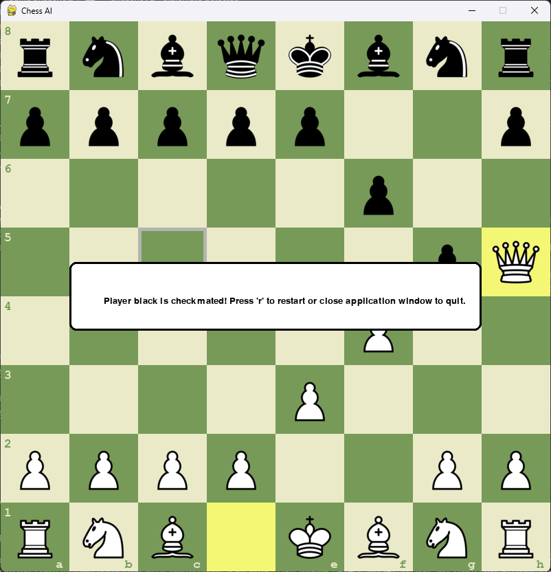
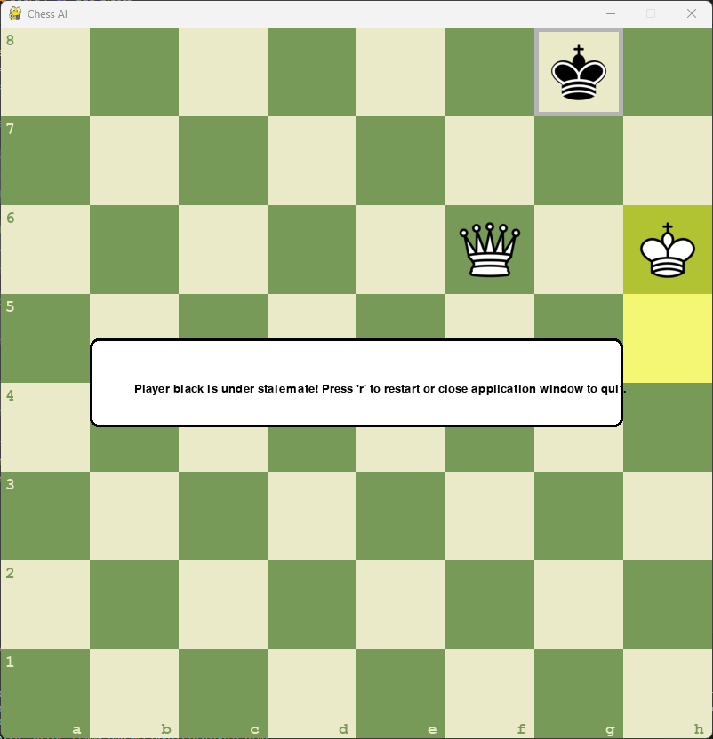
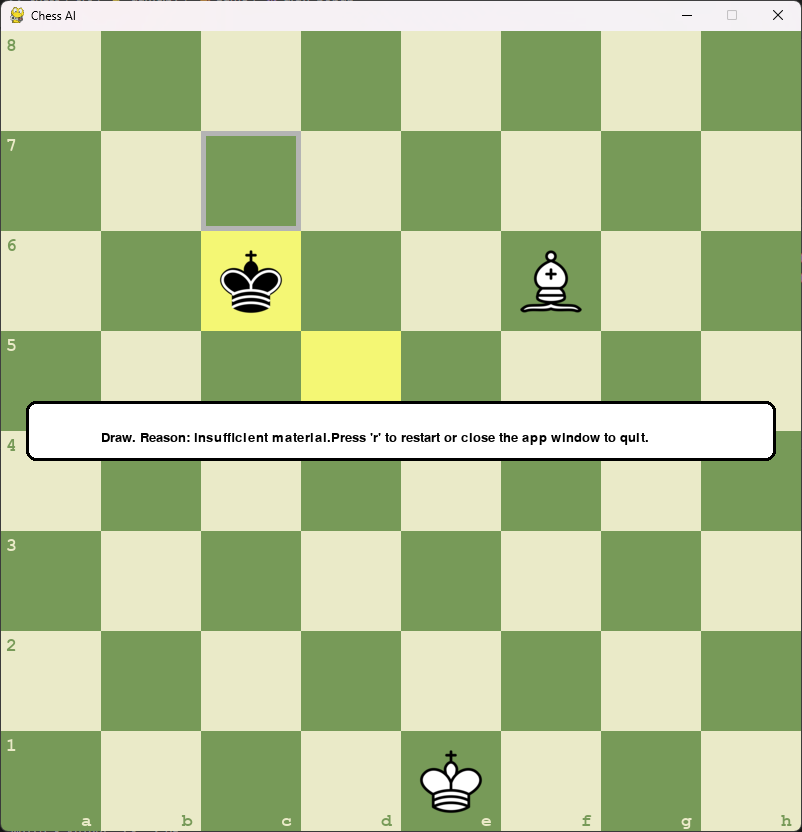

# Overview

This project is a chessboard with AI mode written in Python. It uses a pygame library.  
It is an improved version of the chessboard project created by AlejoG10.  
Alejo's original code is available on GH at https://github.com/AlejoG10/python-chess-ai-yt  
AlejoG10 has also created 5 hours long hands-on tutorial on Youtube https://www.youtube.com/watch?v=OpL0Gcfn4B4 (watch it if you'd like to implement a chessboard "from scratch").  
However I've found several bugs and missing functionalities in his implementation so I've decided to work on it.  

About the most recent version of the project:  
- It implements the simplest minimax algorithm for AI.  
- Performance has improved 5 times comparing to previous version just by optimizing original data structures and code flow.  
- You can select 3 game modes: player vs. player, player vs. AI and AI vs. player.  

Unfortunately AI is still very slow.  
It runs fast only on AI_MAX_DEPTH = 2 (predicts only 2 piece moves ahead).  
On AI_MAX_DEPTH = 3 you need to wait ~30 seconds for AI to make a move.  
No reason to play at higher depths.  
To further improve performance I will implement alpha-beta pruning for minimax.  

# List of game improvements

## Features not present in the original code:
 IMPLEMENTED:   Feature 1. Detect when a King is actually in check.  
 IMPLEMENTED:   Feature 2. Detect checkmate position.  
 IMPLEMENTED:   Feature 3. Detect stalemate position.  
 IMPLEMENTED:   Feature 4. Detect draw position in case of: position on the board repeated 3 times OR both players don't have enough material to win OR 50 moves made without capturing a piece and no pawn move. See details on: https://en.wikipedia.org/wiki/Draw_%28chess%29#Draws_in_all_games 
 NOTE: Currently 3 fold repetition is turned off.  
 IMPLEMENTED:   Feature 5. Storing and displaying list of all moves made from the start of the game. (press 'd' key)  
 IMPLEMENTED:   Feature 6. Undo move. Implemented ONLY for player vs player mode. (press 'u' key)  
 IMPLEMENTED:   Feature 7. Implement simplest Player vs Computer AI using simple minimax algorithm.  
 IMPLEMENTED:   Feature 8. User can select 3 game modes: player vs. player, player vs. AI and AI vs. player.  
 TODO:          Feature 9. Implement optimized minimax algorithm (with alpha-beta pruning) for Player vs Computer AI.  
 TODO:          Feature 10. Implement Player vs Computer AI using better method (hopefully reinforcement learning).  

## Bugs:
 FIXED:     Bug 1. There was a bug in calculating list of valid moves for King if he is in check or some fields around King is "in check".  
            It prevented King under check to make a valid move so it couldn't move.  
 FIXED:     Bug 2. Sometimes a Knight couldn't capture an enemy piece if that enemy piece was giving a check.  
 FIXED:     Bug 3. King was allowed to move to a square adjacent to an enemy King and as a result it could capture enemy King.  
 FIXED:     Bug 4. Queen, Rook, Bishop and Knight were allowed to capture enemy King when starting a game from other position than initial.  
 TODO:      Bug 5. Sometimes when playing with AI, a user is not allowed to perform valid queenside Castling.  

## Performance improvements:
 IMPLEMENTED:   Improvement 1. Increase performance by redesigning program data structures. Mainly to avoid very costly deepcopy() operations.  This will also simplify overall program logic.  
 
 TODO:          Improvement 2. Efficient method of avoiding putting the King in check suggested by 'Wave Treader':  
 "This method does not need any copy or simulating all possible moves, it does not need to check for all opponent's possible moves.  
 It works like this.... you must have tracked the kings position every move and save it.  
 Make the move even if it puts the king in check, from there check from the king's position if any piece attacks it by looking at capture moves from the king's position.  
 If it results in a capture, just undo the move. it happens really fast you wont see the invalid move being executed.  
 The idea is that you make a function that assumes the king can move like a queen, bishop, rook, knight or pawn capture."  

# Game Snapshots

## Snapshot 1 - Checkmate detected

## Snapshot 2 - Draw - stalemate detected

## Snapshot 3 - Draw - insufficient material

## Snapshot 4 - Select game mode

# How to run?
1. Clone, fork or download the project, then go to the project's main directory  
2. pip install -r requirements.txt
3. python .\src\main.py # on Windows OS

When cloning you can choose which version of the code to clone.  
Available tags:  
- baseline_no_AI  - minimal changes to original AlejoG10 code  
- minimax_slow_AI - above + introduced player vs AI mode
- minimax_v2_AI - above + performance improved ~5 times